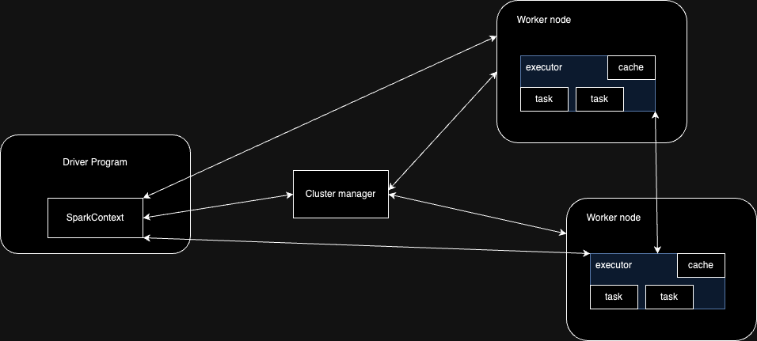
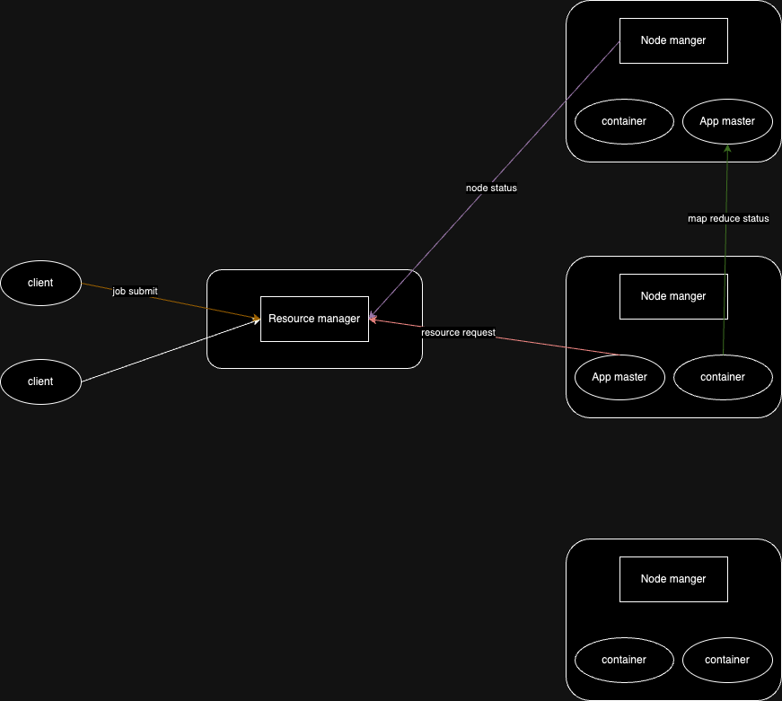

# Apache spark
- 빅데이터 처리를 위한 통합 컴퓨팅 엔진, 클러스터 환경에서 데이터를 병렬로 처리하는 라이브러리 집합
  - 실제 데이터에 대한 연산을 수행하는 컴퓨팅 노드의 개수를 사전에 추가 할 수 있음

## Apache spark conecpt
### 통합
- 통합은 우리가 무슨 작업(e.g. read, sql, ml, stream 처리)를 하든, 동일한 연산 엔진과 일관성있는 api를 제공한다는 의미
  - 따라서 우리가 sql 작업을 하든, stream 처리 작업을 하든, 우리가 사용하는 api는 크게 다르지 않음
- spark가 나오기 전에는 시스템에서 제공해주는 라이브러리와 타 소프트웨어에서 제공하는 api를 결합해서 사용

<br/>

### 컴퓨팅 엔진
- spark는 데이터에 대한 연산만을 수행 할 뿐
  - read/write를 하기 위해서, 우리는 별도의 저장소를 따로 준비해야한다.
- 대신, spark는 여러 저장소에 read/write하는 것을 지원(e.g. mongodb connector for spark, spark-es)
- 우리가 어떤 저장소를 사용하든, 우리는 일관성 있는 api를 사용하기 때문에, SparkConf, format, option 부분의 인수만 저장소 스펙에 맞게 변경하면 됨

<br/>

**spark read from es**

```python
SparkConf conf = new SparkConf();
conf.set("spark.es.nodes", "your host name");
conf.set("spark.es.port", "your port number");

SparkSession sparkSession = SparkSession.builder().config(conf).getOrCreate();
DataSet<Row> dataset = sparkSession.read().format("org.elasticsearch.spark.sql").option("es.resource", "your index with type").load()
```

<br/>

**spark read from mongodb**

```python
SparkConf conf = new SparkConf();
conf.set("spark.mongodb.read.connection.uri", "your endpoint");
SparkSession sparkSession = SparkSession().builder().config(conf).getOrCreate();
DataSet<Row> dataset = sparkSession().read().foramt("mongodb").option("spark.mongodb.read.database", "your db").option("spark.mongodb.read.collection", "your collection").load()
```

<br/>

### 라이브러리
- spark는 표준 라이브러리와 외부 라이브러리를 제공
  - 위의 언급된 mongodb connector for spark, spark-es는 각각 mongodb, es측에서 만들었음
  - spark에서 제공하는 라이브러리로, spark sql, graphx가 존재함

### spark가 세상에 나온 이유?
- cpu 발전의 한계 때문에, 병렬 컴퓨팅이 중요해짐
  - 특히, 데이터 수집 비용이 저렴해지면서, 데이터를 많이 얻을 수 있지만, 대규모 데이터를 처리 할 수 있는 환경은 부족했다.

### spark history
- 기존에는 데이터를 병렬처리 하기 위해, hadoop mr을 사용했지만 다음의 단점이 존재했음
1. 각 단계별로 mr job을 개발해서 각 job을 클러스터에게 개별적으로 실행해야하는 비효율성
- iterative processing에 적합하지 않음
2. map과 reduce phase 사이에서 disk I/O 발생

<br/>

이 문제를 해결하기 위해,
- spark는 여러 단계로 이루어진 애플리케이션을 쉽게 개발 할 수 있도록, 함수형 기반의 api 설계
- 연산 단계 사이의 데이터를 메모리에 저장함으로써 효율성 증가

<br/>

초기에는 함수형 기반의 api에 중점을 뒀으나, 1.0버전 이후 구조화된 데이터를 기반으로 동작하는 신규 spark sql 추가

### spark 실습

```python
from pyspark.sql import SparkSession


def init_spark():
    spark = SparkSession.builder.appName("Hello world").getOrCreate()
    return spark.sparkContext


def main():
    sc = init_spark()
    nums = sc.parallelize([1, 2, 3, 4])
    collect = nums.map(lambda x: x ** 2).collect()
    print(collect)


if __name__ == '__main__':
    main()
```

## spark 기본 아키텍처
- 클러스터: 다수의 컴퓨터 자원을 모아서 하나처럼 사용하는 것



<br/>

하나처럼 사용하려면, 다수의 컴퓨팅 시스템을 지원하는 컴포넌트가 필요한데, spark는 이를 지원한다.(e.g. 데이터 처리 작업 조율, 처리)
<br/>
spark 실행을 지원하는 클러스터는 hadoop yarn, standalone 클러스터 매니저, 메소스

### spark application
- 하나의 driver, 다수의 executor로 구성
- driver는 클러스터 노드 중 하나에서 실행되며, `main()` 함수 실행. 사용자 프로그램과의 상호 작용, executor에 대한 작업 분석, 배포, 스케줄링 등
- 컴퓨팅 자원을 할당하는 주체? <- 클러스터 매니저

### yarn 아키텍처



<br/>

- resource manager: 시스템 안에 있는 모든 application들 사이에서 자원 관리를 담당한다.
- node manager: machine당 하나씩 존재하며(agent) container에 대한 책임을 갖고 있다.
- application master: framework specific library. resource manager와 협상 담당. task들을 관리 실행을 node manager와 함께함


### spark on yarn

**client mode**


<br/>

**cluster mode**


<br/>

reference: https://sujithjay.com/spark/with-yarn

<br/>

### 파티션
- RDDs나 Dataset을 구성하는 최소 단위 객체
- 최소 작업 단위
- row의 집합

**1core=1task=1partition**

<br/>

### 트랜스포메이션
- spark 데이터는 불변(immutable)
- 트랜스포메이션은 데이터를 변경하는 방법, 실제 수행은 하지않음
- 비즈니스 로직 표현
- 좁은 의존성과 넓은 의존성을 갖는다

<br/>

**좁은 의존성**: 하나의 입력이 하나의 출력에만 영향을 준다. <br/>
- 여러 필터를 갖는 경우, 모든 작업이 메모리 위에서 처리
- filter, map

<br/>

**넓은 의존성**: 다수의 입력이 하나의 출력에 영항을 준다. <br/>
- 셔플이 발생하게 되는데, 셔플은 디스크에 저장됨
- groupBy
  - 동일한 key를 갖는 element들을 동일한 파티션 안으로 가져와야하기 때문에.

<br/>

### 지연 연산
- spark는 연산을 바로 수행하지 않음. 연산 그래프를 처리하기 직전까지 기다린다.
- predicate push down: 데이터 검색 연산의 성능을 올리는 최적화 기법
  - 데이터 소스에 filtering 작업을 위임 -> 메모리에 올릴 데이터의 양을 줄일 수 있다.
- 비순환 방향 그래프

### 액션
- 실제 연산을 수행
- count

### explain

```text
== Physical Plan ==
AdaptiveSparkPlan isFinalPlan=false
+- Sort [count#19 ASC NULLS FIRST], true, 0
   +- Exchange rangepartitioning(count#19 ASC NULLS FIRST, 200), ENSURE_REQUIREMENTS, [plan_id=27]
      +- FileScan csv [DEST_COUNTRY_NAME#17,ORIGIN_COUNTRY_NAME#18,count#19] Batched: false, DataFilters: [], Format: CSV, Location: InMemoryFileIndex(1 paths)[file:/Users/PycharmProjects/spark-guide/data/flight-data/csv/20..., PartitionFilters: [], PushedFilters: [], ReadSchema: struct<DEST_COUNTRY_NAME:string,ORIGIN_COUNTRY_NAME:string,count:int>

```
- Sort, Exchange, FileScan: spark가 가리키는 operation

<br/>

**sort**
- count#19의 `#19`: spark가 가리키는 column 식별자
- true: global sort. 반대되는 경우로 local sort가 있으며 partition내 정렬
- 0: 가장 outer-level sort

<br/>

**Exchange**
- shuffle operation
- 200: 생성되는 파티션 개수
- plan_id=27: tracking or debugging


### 파티셔닝 기법

**hash partitioning**
- 파티션 키를 해시 함수에 적용
- data skew가 발생하지 않음
- groupByKey, reduceByKey

<br/>

**range partitioning**
- 파티션 키의 range를 기준으로 파티셔닝
- sortedByKey


