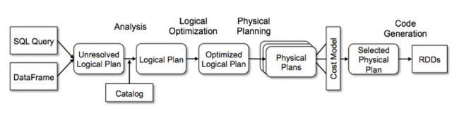
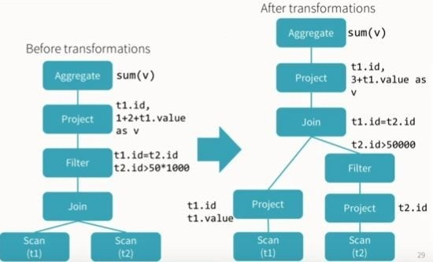

# Apache Spark study 3주차

## Dataset vs DataFrame
 Dataset, DataFrame 모두 데이터에 관한 분산 컬렉션이지만 다음의 관점에 따라 약간의 차이가 존재  
 
### Type safety
DataFrame은 type-safe하지 않음 -> 따라서, spark가 예측한 스키마와 실제 데이터 구조가 다르다면, 런타임 시점에 에러 발생  
반면, Dataset은 strongly-typed. 따라서, type이 일치하지 않으면 컴파일 시점에서 에러 발생  

### Performance
type에 민감하지 않는다면, DataFrame을 사용하는 것이 좋음
- 고수준 추상화 위에서 연산되고, Catalyst optimizer에 의해 더 적극적으로 최적화됨

 

Dataset의 경우, optimizer의 이점이 직력화/역직렬화에 따른 오버헤드보다 크다면 사용하는 것이 좋음
- strongly-typed이기 때문에, DataFrame에 비해 추가적인 오버헤드가 존재 

 

### API 사용법
DataFrame은 DSL을 지원하며, SQL 사용법과 비슷함. Dataset의 경우, 함수형 프로그래밍과 비슷(e.g. filter, map, reduce)  

그렇다면, 언제 DataFrame을 사용하고 언제 Dataset을 사용해야할까?
- DataFrame: 컴파일 시점에 스키마를 알고 있을 때, SQL-like 문법을 사용하고 싶을 때
- Dataset: type 안정성이 필요할 때, 복잡한 데이터 처리(e.g. nested object를 이용한 복잡한 연산)

 

## Spark 실행 과정

 

spark의 동작은 크게 3가지로 나누어지게됨
- business logic
  - spark api로 작성한 코드
- logical plan
- physical plan

 

### logical plan
- 사용자 쿼리를 추상적으로 표현
- 이 단계는 catalyst optimizer의 일부다. 한편 optimizer는 실행을 위한 쿼리를 최적화

 

logical plan가 있는 이유?
- 실제 실행 방법과 개별적으로 분리해서 사용자의 의도를 이해할 수 있음 -> 정교한 최적화 전략을 쓸 수 있음
- 쿼리를 실제로 실행하기 전에, 다양한 최적화를 적용할 수 있음(e.g. predicate pushdown, projection pruning)
- 개발자가 logical plan을 통해 새로운 최적화 규칙 또는 logical plan node를 확장 할 수 있음

logical plan은 트리로 표현되며, 각 node는 하나의 데이터에 대한 transformation or action
- node는 연산에 상응하며, edge는 연산들 사이에서, 한 데이터의 흐름을 표현

 

logical plan은 unresolved logical plan과 resolved logical plan으로 나뉘게 된다.  

#### unresolved logical plan
- 사용자 쿼리로부터 직접 생성된 logical plan의 초기 버전
- 이 plan은 테이블 또는 칼럼의 참조를 갖고 있는데, 이 때 테이블 또는 칼럼은 catalog에 있는 스키마로 검증되지 않음

### resolved logical plan
- catalog에 있는 스키마로 테이블 또는 칼럼을 검증 완료했고, 이상 없으면, resolved logical plan이 됨
- plan 내 모든 연산은 검증됐고, data source로 직접 매핑 될 수 있음을 의미

### Logical plan 처리 과정
1. parsing: SQL 쿼리 또는 DataFrame -> 쿼리의 구조를 표현하는 AST로 파싱
2. analyzing: AST는 unresolved logical plan으로 변환되며, 여기서 데이터 구조를 검증
3. optimization
4. physical planning

#### Logical plan의 optimization 예
- 수행 가능한 모든 task가 특정 단계에서 하나로 계산 될 수 있는지
- multi join query에서 성능 최적화를 위한 쿼리 실행 순서 결정
- project 이전에, filter를 평가함으로써 쿼리 최적

 

 

### physical plan
- execution plan이라고 불리며, logical plan이 어떻게 클러스터에서 실행되는지 구체화함

#### physical plan 처리 과정
1. physical plan generation
2. cost estimation
3. physical plan selection

